# React Reconciler Mermaid 流程图集合

本文档包含了 React Reconciler 的详细 Mermaid 流程图，用于可视化展示整个协调器的工作流程。

## 1. 主要调用流程图

### 1.1 整体调用链路

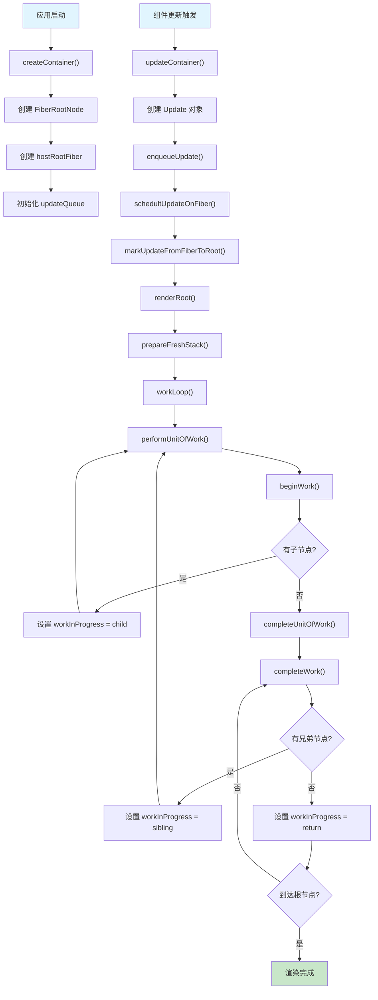

### 1.2 函数调用时序图

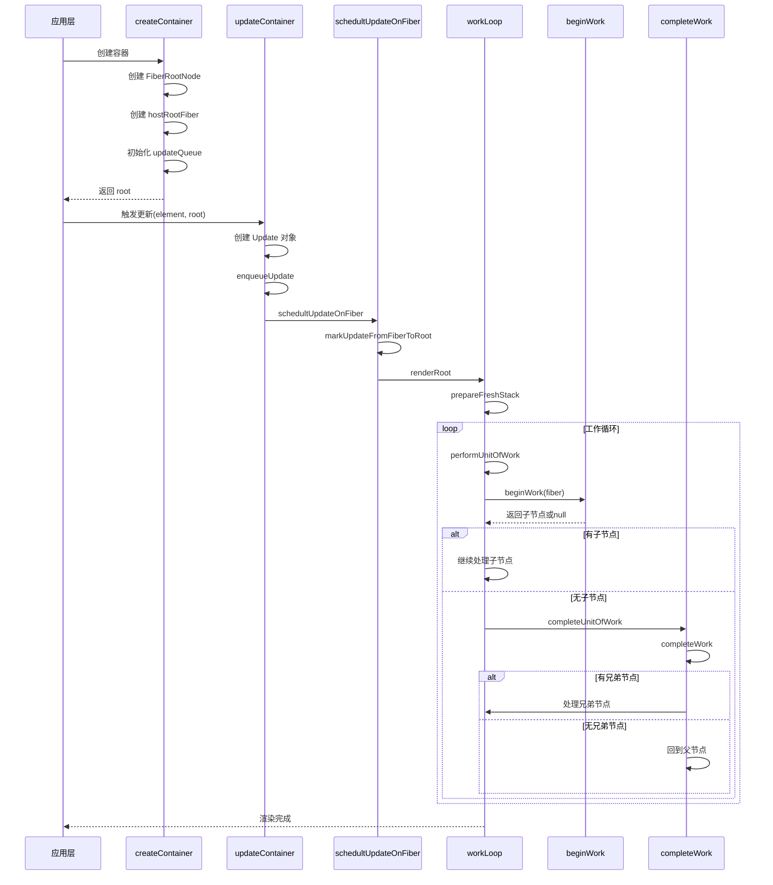

## 2. 工作循环详细流程图

### 2.1 workLoop 核心机制

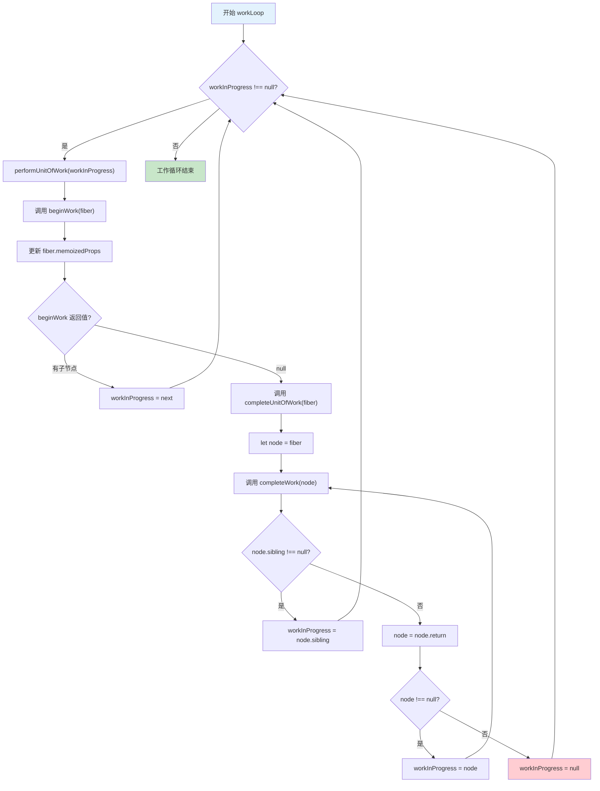

### 2.2 performUnitOfWork 详细流程

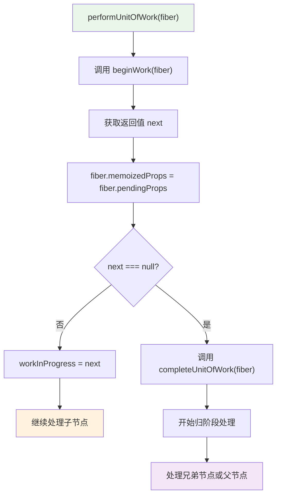

## 3. 双缓冲机制流程图

### 3.1 createWorkInProgress 双缓冲实现

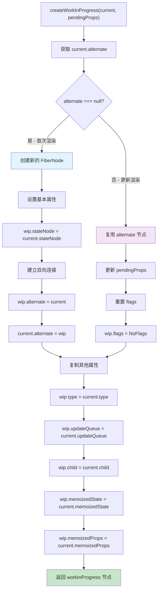

### 3.2 双缓冲树切换机制

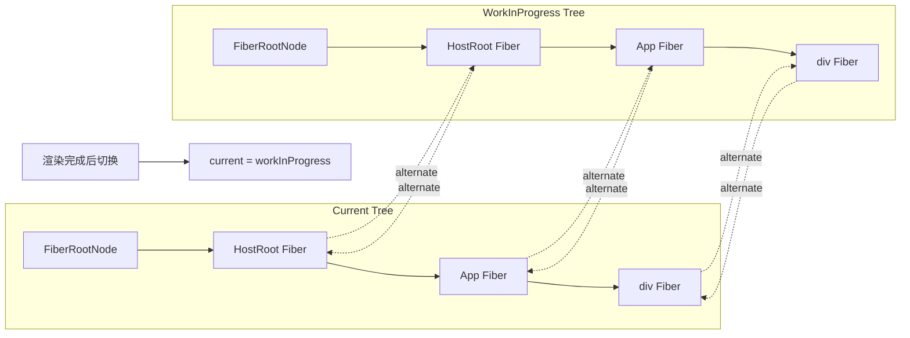

## 4. 更新队列处理流程图

### 4.1 更新队列操作流程

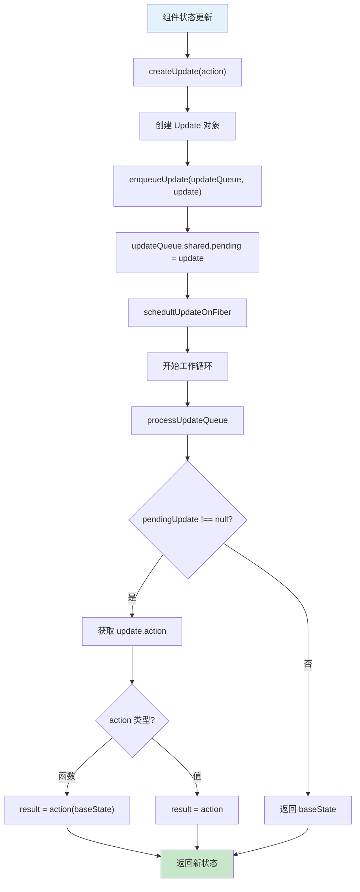

### 4.2 Update 对象结构图

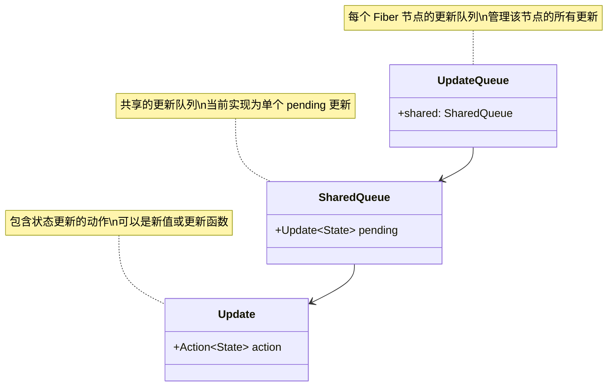

## 5. Fiber 树遍历流程图

### 5.1 深度优先遍历策略

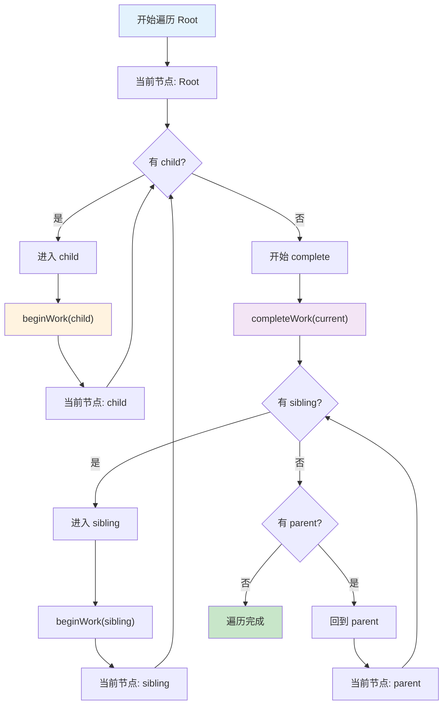

### 5.2 Fiber 节点关系图

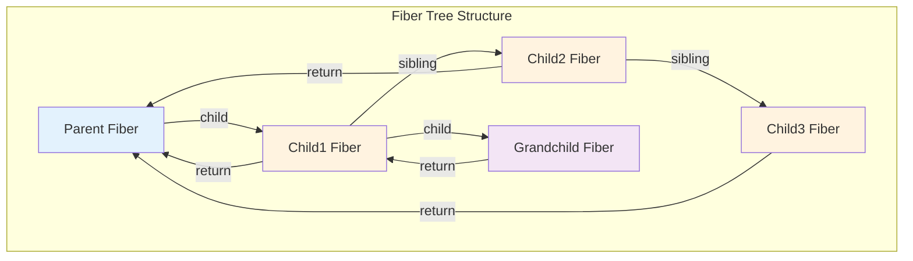

## 6. 错误处理和恢复流程

### 6.1 workLoop 错误处理机制

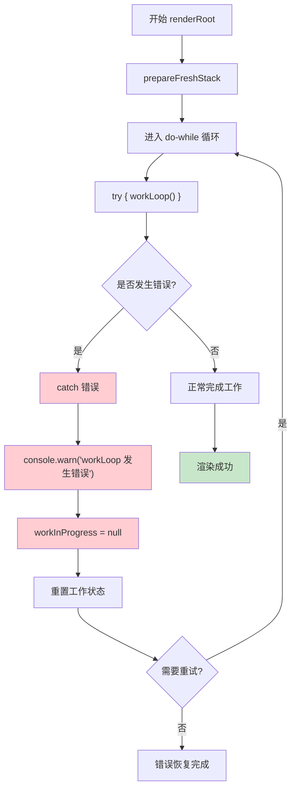

## 7. 总结

这些 Mermaid 流程图全面展示了 React Reconciler 的工作机制：

1. **主要调用流程图**：展示了从应用启动到渲染完成的完整调用链路
2. **工作循环详细流程图**：深入展示了 workLoop 的核心机制和 performUnitOfWork 的处理逻辑
3. **双缓冲机制流程图**：说明了 createWorkInProgress 的实现和双缓冲树的切换机制
4. **更新队列处理流程图**：展示了状态更新的处理流程和数据结构
5. **Fiber 树遍历流程图**：说明了深度优先遍历策略和节点关系
6. **错误处理流程图**：展示了错误恢复机制

这些流程图为理解 React Reconciler 的工作原理提供了清晰的可视化参考。
