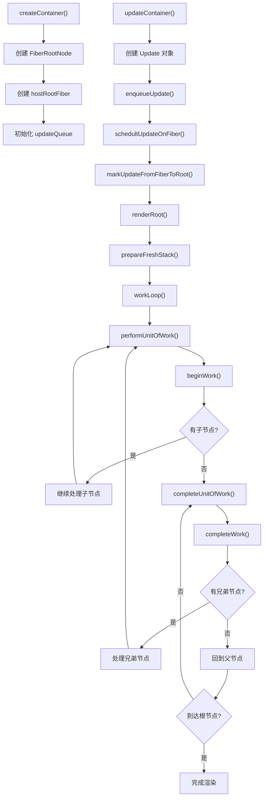

# React Reconciler 调用顺序与函数作用分析

## 1. 整体架构概述

React Reconciler 是 React 的核心协调器，负责管理 Fiber 树的构建、更新和调度。它采用了 Fiber 架构，通过可中断的工作循环来实现高效的 UI 更新。

### 核心设计理念

- **Fiber 架构**：每个 React 元素对应一个 Fiber 节点，形成 Fiber 树
- **双缓冲机制**：通过 current 树和 workInProgress 树实现无缝切换
- **可中断调度**：工作可以被分片，支持优先级调度
- **递归转迭代**：将递归的 reconciliation 过程转换为可控的迭代过程

## 2. 主要调用流程图



## 3. 核心函数详细说明

### 3.1 入口函数

#### createContainer(container: Container)

**作用**：创建 React 应用的根容器
**调用时机**：应用初始化时
**执行流程**：

1. 创建 hostRootFiber（HostRoot 类型的 Fiber 节点）
2. 创建 FiberRootNode，建立容器与 Fiber 树的连接
3. 为 hostRootFiber 初始化 updateQueue
4. 返回 FiberRootNode 实例

```typescript
export function createContainer(container: Container) {
  const hostRootFiber = new FiberNode(HostRoot, {}, null);
  const root = new FiberRootNode(container, hostRootFiber);
  hostRootFiber.updateQueue = createUpdateQueue();
  return root;
}
```

#### updateContainer(element: ReactElementType | null, root: FiberRootNode)

**作用**：触发 React 应用的更新
**调用时机**：ReactDOM.render() 或状态更新时
**执行流程**：

1. 获取 hostRootFiber
2. 创建包含新元素的 Update 对象
3. 将 Update 加入更新队列
4. 调度 Fiber 更新

### 3.2 调度与工作循环

#### schedultUpdateOnFiber(fiber: FiberNode)

**作用**：调度 Fiber 节点的更新
**执行流程**：

1. 通过 `markUpdateFromFiberToRoot()` 找到根节点
2. 调用 `renderRoot()` 开始渲染过程

#### markUpdateFromFiberToRoot(fiber: FiberNode)

**作用**：从当前 Fiber 节点向上遍历找到根节点
**算法**：沿着 `return` 指针向上遍历，直到找到 HostRoot 类型的节点

#### renderRoot(root: FiberRootNode)

**作用**：渲染根节点，启动工作循环
**执行流程**：

1. 调用 `prepareFreshStack()` 初始化工作栈
2. 进入 `workLoop()` 开始工作循环
3. 异常处理和错误恢复

#### prepareFreshStack(root: FiberRootNode)

**作用**：准备新的工作栈
**功能**：通过 `createWorkInProgress()` 创建 workInProgress 树的根节点

#### workLoop()

**作用**：主工作循环
**机制**：持续调用 `performUnitOfWork()` 处理 workInProgress 节点，直到所有工作完成

### 3.3 工作单元处理

#### performUnitOfWork(fiber: FiberNode)

**作用**：处理单个工作单元（Fiber 节点）
**执行流程**：

1. 调用 `beginWork()` 处理当前节点（递阶段）
2. 更新 memoizedProps
3. 如果没有子节点，调用 `completeUnitOfWork()`（归阶段）
4. 如果有子节点，继续处理子节点

#### beginWork(fiber: FiberNode)

**作用**：递阶段的工作，处理 Fiber 节点
**当前实现**：简单返回子节点，后续会扩展为根据节点类型进行不同处理
**未来扩展**：

- 函数组件：执行函数，处理 Hooks
- 类组件：调用生命周期方法
- 原生元素：创建或更新 DOM 属性

#### completeUnitOfWork(fiber: FiberNode)

**作用**：完成当前工作单元，处理兄弟节点和父节点
**执行流程**：

1. 调用 `completeWork()` 完成当前节点
2. 检查是否有兄弟节点，有则处理兄弟节点
3. 没有兄弟节点则回到父节点继续完成工作
4. 重复直到回到根节点

#### completeWork(fiber: FiberNode)

**作用**：归阶段的工作，完成 Fiber 节点的处理
**当前实现**：简单返回父节点
**未来扩展**：

- 创建或更新真实 DOM 节点
- 收集副作用（effects）
- 处理 ref

## 4. 数据结构说明

### 4.1 FiberNode

**作用**：Fiber 架构的核心数据结构，代表一个工作单元

**关键属性**：

```typescript
export class FiberNode {
  // 节点标识
  tag: WorkTag; // 节点类型（函数组件、类组件、原生元素等）
  key: Key; // React key
  type: Type; // 元素类型（如 'div'、函数组件等）

  // 树结构
  return: FiberNode | null; // 父节点
  sibling: FiberNode | null; // 兄弟节点
  child: FiberNode | null; // 第一个子节点
  index: number; // 在父节点中的索引

  // 状态和属性
  pendingPorps: Props; // 待处理的 props
  memoizedProps: Props | null; // 已处理的 props
  memoizedState: any; // 组件状态
  updateQueue: unknown; // 更新队列

  // 双缓冲
  alternate: FiberNode | null; // 对应的另一棵树中的节点

  // 副作用
  flags: Flags; // 副作用标记

  // DOM 相关
  stateNode: any; // 对应的真实 DOM 节点或组件实例
  ref: Ref; // ref 引用
}
```

### 4.2 FiberRootNode

**作用**：Fiber 树的根节点，连接容器和 Fiber 树

**关键属性**：

```typescript
export class FiberRootNode {
  container: Container; // DOM 容器
  current: FiberNode; // 当前 Fiber 树的根节点
  finishedWork: FiberNode | null; // 完成工作的 Fiber 树根节点
}
```

### 4.3 双缓冲机制

**createWorkInProgress(current: FiberNode, pendingPorps: Props)**
**作用**：实现双缓冲机制，创建或复用 workInProgress 节点

**机制说明**：

- **首次渲染（mount）**：创建新的 workInProgress 节点
- **更新（update）**：复用已存在的 alternate 节点
- **优势**：避免频繁创建对象，提高性能

## 5. 更新队列机制

### 5.1 Update 对象

```typescript
export interface Update<State> {
  action: Action<State>; // 更新动作（新状态或状态更新函数）
}
```

### 5.2 UpdateQueue 结构

```typescript
export interface UpdateQueue<State> {
  shared: {
    pending: Update<State> | null; // 待处理的更新
  };
}
```

### 5.3 核心函数

#### createUpdate<State>(action: Action<State>)

**作用**：创建更新对象

#### createUpdateQueue<Action>()

**作用**：创建更新队列

#### enqueueUpdate<Action>(updateQueue, update)

**作用**：将更新加入队列
**机制**：当前实现为简单覆盖，后续会实现链表结构支持多个更新

#### processUpdateQueue<State>(baseState, pendingUpdate)

**作用**：处理更新队列，计算新状态
**逻辑**：

- 如果 action 是函数，调用函数计算新状态
- 如果 action 是值，直接使用该值作为新状态

## 6. 工作循环机制详解

### 6.1 递归转迭代

传统的递归 reconciliation 被转换为可控的迭代过程：

**递阶段（beginWork）**：

- 从根节点开始，深度优先遍历
- 处理每个节点，创建或更新子节点
- 继续处理子节点

**归阶段（completeWork）**：

- 当没有子节点时，开始归阶段
- 完成当前节点的工作
- 处理兄弟节点或回到父节点

### 6.2 可中断性

虽然当前实现还未支持中断，但架构已为此做好准备：

- 工作循环基于 `workInProgress` 全局变量
- 每个 `performUnitOfWork` 都是独立的工作单元
- 未来可以在工作单元之间插入调度逻辑

### 6.3 错误处理

- `renderRoot` 中包含 try-catch 错误边界
- 发生错误时重置 `workInProgress` 状态
- 为错误恢复和错误边界功能奠定基础

## 7. 执行时序总结

1. **初始化阶段**：`createContainer` → 创建 Fiber 树结构
2. **更新触发**：`updateContainer` → 创建更新并加入队列
3. **调度阶段**：`schedultUpdateOnFiber` → 找到根节点并开始渲染
4. **准备阶段**：`prepareFreshStack` → 创建 workInProgress 树
5. **工作循环**：`workLoop` → 持续处理工作单元
6. **递阶段**：`beginWork` → 处理节点并向下遍历
7. **归阶段**：`completeWork` → 完成节点并向上回溯
8. **完成渲染**：所有节点处理完成

这个架构为 React 的高性能渲染、时间切片、优先级调度等高级特性提供了坚实的基础。
