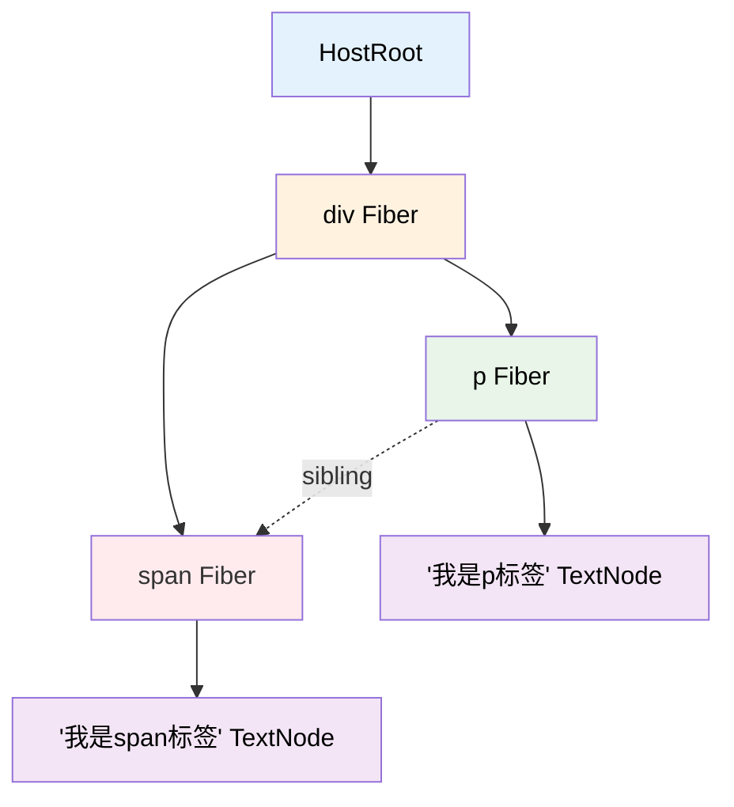
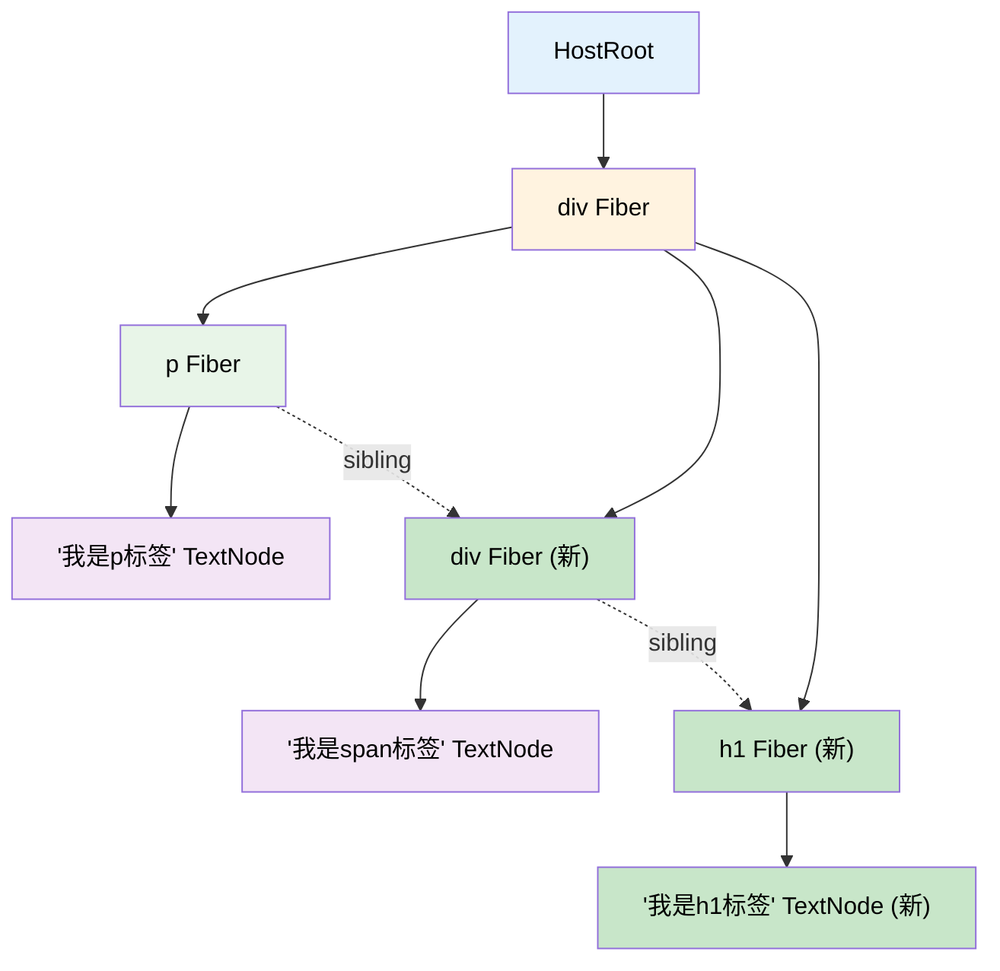
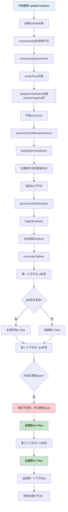
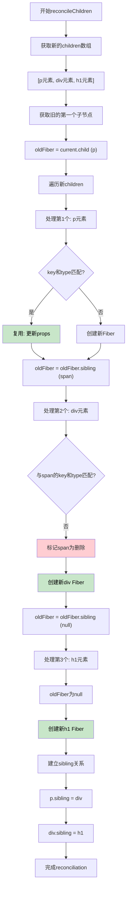
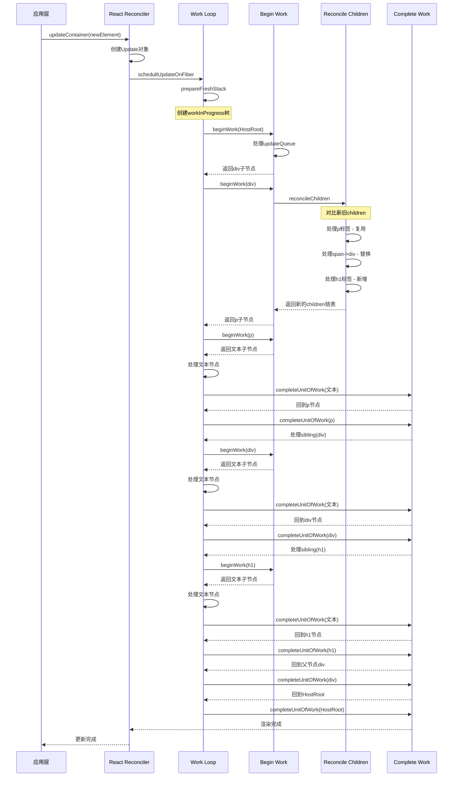
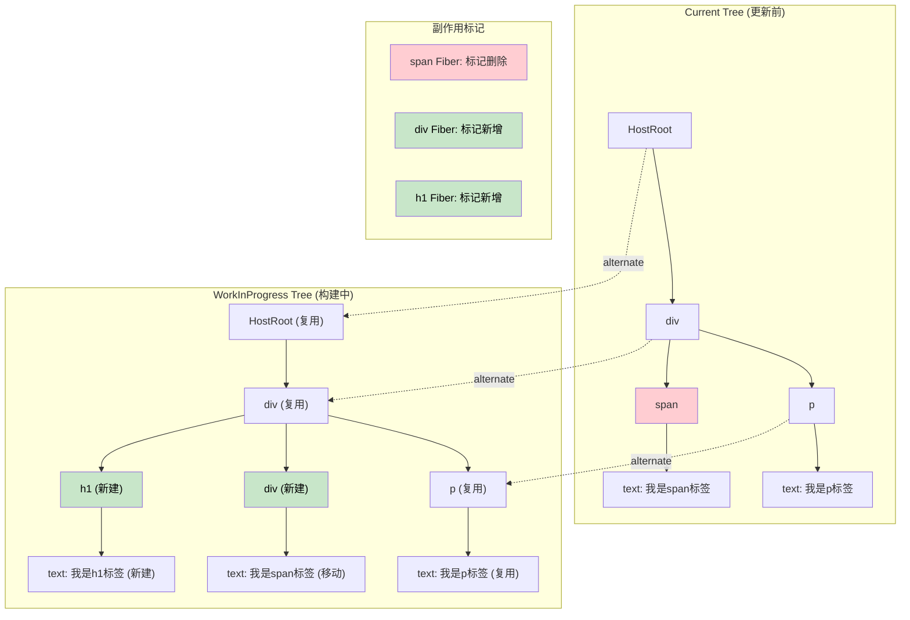

## 例子

如果从

```jsx
<div>
  <p>我是p标签</p>
  <span>我是span标签</span>
</div>
```

更新到

```jsx
<div>
  <p>我是p标签</p>
  <div>我是span标签</div>
  <h1>我是h1标签</h1>
</div>
```

这个状态，整体的更新流程在下面用mermaid进行展示

## 更新分析

### 变化总结

1. **div根节点**：保持不变，可以复用
2. **p标签**：内容和位置都没变，可以复用
3. **span标签**：类型从span变为div，需要替换
4. **h1标签**：新增的节点

### 1. Fiber树结构对比图

#### 更新前的Fiber树结构



#### 更新后的Fiber树结构



### 2. 详细的Reconciliation过程流程图



### 3. 节点操作流程图



### 4. 完整的更新流程时序图



### 5. WorkInProgress树构建过程



## 总结

这个更新过程展示了React Reconciler的核心工作原理：

1. **节点复用**：p标签及其文本内容被成功复用
2. **节点替换**：span标签被标记删除，新的div标签被创建
3. **节点新增**：h1标签作为新节点被添加
4. **文本复用**："我是span标签"这个文本节点被从旧的span移动到新的div中

整个过程通过双缓冲机制确保了更新的原子性，通过深度优先遍历确保了所有节点都被正确处理。
